# Converge-NPS Database Schema

**Document Version:** 1.0
**Date:** 2025-12-02
**Author:** Architect Agent
**Status:** Ready for Review

---

## Table of Contents

1. [Overview](#overview)
2. [Database Technology](#database-technology)
3. [Complete Table Definitions](#complete-table-definitions)
4. [Entity-Relationship Diagram](#entity-relationship-diagram)
5. [Indexes Strategy](#indexes-strategy)
6. [Row-Level Security (RLS) Policies](#row-level-security-rls-policies)
7. [Migration Strategy](#migration-strategy)
8. [Performance Considerations](#performance-considerations)
9. [Security Considerations](#security-considerations)
10. [Design Decisions](#design-decisions)

---

## Overview

This database schema supports the Converge-NPS MVP platform, a production-ready enterprise event networking application for the Naval Postgraduate School's Tech Accelerator 2026. The schema is designed to support 500+ concurrent users while maintaining enterprise-grade security, performance, and scalability.

### Key Design Principles

1. **Security First**: Row-Level Security (RLS) enforces all access controls at the database level
2. **Performance Optimized**: Strategic indexing for common query patterns and filters
3. **Audit Trail**: Comprehensive logging of all critical operations
4. **Privacy Aware**: Database-level enforcement of user privacy preferences
5. **Scalable**: Designed for horizontal scaling and connection pooling
6. **Type Safety**: Strict constraints and ENUM types for data integrity

### Schema Statistics

- **Total Tables**: 24 (core tables + audit/history tables)
- **Total Views**: 2 (privacy-aware views)
- **Total Functions**: 12 (rate limiting, privacy filtering, triggers)
- **Total Indexes**: 35+ (performance optimization)
- **Total RLS Policies**: 60+ (fine-grained access control)

---

## Database Technology

**Database**: PostgreSQL 15+
**Extensions Required**:
- `uuid-ossp` - UUID generation
- `pgcrypto` - Cryptographic functions
- `pg_trgm` - Full-text search and fuzzy matching
- `pg_stat_statements` - Query performance monitoring

**Authentication**: Supabase Auth (leveraging `auth.users` table)

---

## Complete Table Definitions

### 1. Authentication & User Management

#### 1.1 `profiles`

User profile information with privacy controls.

```sql
CREATE TABLE public.profiles (
  -- Primary Key
  id UUID PRIMARY KEY REFERENCES auth.users(id) ON DELETE CASCADE,

  -- Basic Information
  full_name TEXT NOT NULL,
  email TEXT NOT NULL,
  phone TEXT,
  rank TEXT, -- Military rank (optional)

  -- Organization
  organization TEXT,
  department TEXT,
  role TEXT, -- Job role/title

  -- Profile Content
  bio TEXT,
  avatar_url TEXT,

  -- Interests & URLs
  acceleration_interests TEXT[],
  linkedin_url TEXT,
  website_url TEXT,

  -- Privacy Controls (4 toggles from PRD)
  profile_visibility TEXT NOT NULL DEFAULT 'public', -- 'public' or 'private'
  allow_qr_scanning BOOLEAN NOT NULL DEFAULT true,
  allow_messaging BOOLEAN NOT NULL DEFAULT true,
  hide_contact_info BOOLEAN NOT NULL DEFAULT false,

  -- Onboarding Status
  onboarding_completed BOOLEAN NOT NULL DEFAULT false,
  onboarding_step INTEGER DEFAULT 0,

  -- Metadata
  created_at TIMESTAMPTZ NOT NULL DEFAULT NOW(),
  updated_at TIMESTAMPTZ NOT NULL DEFAULT NOW(),

  -- Constraints
  CONSTRAINT profiles_full_name_length CHECK (char_length(full_name) <= 100),
  CONSTRAINT profiles_email_length CHECK (char_length(email) <= 255),
  CONSTRAINT profiles_phone_length CHECK (phone IS NULL OR char_length(phone) <= 20),
  CONSTRAINT profiles_rank_length CHECK (rank IS NULL OR char_length(rank) <= 50),
  CONSTRAINT profiles_organization_length CHECK (organization IS NULL OR char_length(organization) <= 100),
  CONSTRAINT profiles_department_length CHECK (department IS NULL OR char_length(department) <= 100),
  CONSTRAINT profiles_role_length CHECK (role IS NULL OR char_length(role) <= 100),
  CONSTRAINT profiles_bio_length CHECK (bio IS NULL OR char_length(bio) <= 500),
  CONSTRAINT profiles_linkedin_url_length CHECK (linkedin_url IS NULL OR char_length(linkedin_url) <= 200),
  CONSTRAINT profiles_website_url_length CHECK (website_url IS NULL OR char_length(website_url) <= 200),
  CONSTRAINT profiles_profile_visibility_check CHECK (profile_visibility IN ('public', 'private'))
);

-- Indexes
CREATE INDEX idx_profiles_email ON public.profiles(email);
CREATE INDEX idx_profiles_organization ON public.profiles(organization);
CREATE INDEX idx_profiles_department ON public.profiles(department);
CREATE INDEX idx_profiles_phone ON public.profiles(phone) WHERE phone IS NOT NULL;
CREATE INDEX idx_profiles_profile_visibility ON public.profiles(profile_visibility);

-- Full-text search index for profiles
CREATE INDEX idx_profiles_full_name_trgm ON public.profiles USING gin(full_name gin_trgm_ops);
CREATE INDEX idx_profiles_organization_trgm ON public.profiles USING gin(organization gin_trgm_ops);

-- Trigger for updated_at
CREATE TRIGGER update_profiles_updated_at
  BEFORE UPDATE ON public.profiles
  FOR EACH ROW
  EXECUTE FUNCTION handle_updated_at();

-- Trigger for profile update rate limiting
CREATE TRIGGER check_profile_update_rate_limit_trigger
  BEFORE UPDATE ON public.profiles
  FOR EACH ROW
  EXECUTE FUNCTION check_profile_update_rate_limit();

-- Comment
COMMENT ON TABLE public.profiles IS 'User profiles with privacy controls and onboarding status';
```

#### 1.2 `user_roles`

Role-based access control (RBAC) for users.

```sql
-- ENUM for roles (5 roles from PRD)
CREATE TYPE public.app_role AS ENUM (
  'student',
  'faculty',
  'industry',
  'staff',
  'admin'
);

CREATE TABLE public.user_roles (
  id UUID PRIMARY KEY DEFAULT gen_random_uuid(),
  user_id UUID NOT NULL REFERENCES auth.users(id) ON DELETE CASCADE,
  role public.app_role NOT NULL,
  created_at TIMESTAMPTZ NOT NULL DEFAULT NOW(),

  -- Unique constraint: user can have each role only once
  CONSTRAINT user_roles_user_id_role_key UNIQUE (user_id, role)
);

-- Indexes
CREATE INDEX idx_user_roles_user_id ON public.user_roles(user_id);
CREATE INDEX idx_user_roles_role ON public.user_roles(role);

-- Comment
COMMENT ON TABLE public.user_roles IS 'User role assignments for RBAC';
```

#### 1.3 `user_role_history`

Audit trail for role changes.

```sql
CREATE TABLE public.user_role_history (
  id UUID PRIMARY KEY DEFAULT gen_random_uuid(),
  user_id UUID NOT NULL REFERENCES auth.users(id) ON DELETE CASCADE,
  role public.app_role NOT NULL,
  action TEXT NOT NULL, -- 'added' or 'removed'
  changed_by UUID NOT NULL REFERENCES auth.users(id),
  changed_at TIMESTAMPTZ NOT NULL DEFAULT NOW(),
  notes TEXT,

  CONSTRAINT user_role_history_action_check CHECK (action IN ('added', 'removed'))
);

-- Indexes
CREATE INDEX idx_user_role_history_user_id ON public.user_role_history(user_id);
CREATE INDEX idx_user_role_history_changed_at ON public.user_role_history(changed_at DESC);

-- Comment
COMMENT ON TABLE public.user_role_history IS 'Audit trail for user role changes';
```

#### 1.4 `qr_codes`

QR code generation tracking for users.

```sql
CREATE TABLE public.qr_codes (
  id UUID PRIMARY KEY DEFAULT gen_random_uuid(),
  user_id UUID NOT NULL REFERENCES auth.users(id) ON DELETE CASCADE,
  qr_code_data TEXT NOT NULL, -- Encoded UUID or custom code
  is_active BOOLEAN NOT NULL DEFAULT true,
  generated_at TIMESTAMPTZ NOT NULL DEFAULT NOW(),
  last_scanned_at TIMESTAMPTZ,
  scan_count INTEGER NOT NULL DEFAULT 0,

  CONSTRAINT qr_codes_user_id_key UNIQUE (user_id) -- One active QR code per user
);

-- Indexes
CREATE INDEX idx_qr_codes_user_id ON public.qr_codes(user_id);
CREATE INDEX idx_qr_codes_qr_code_data ON public.qr_codes(qr_code_data);
CREATE INDEX idx_qr_codes_is_active ON public.qr_codes(is_active);

-- Comment
COMMENT ON TABLE public.qr_codes IS 'QR code tracking for user badges';
```

---

### 2. Networking & Connections

#### 2.1 `connections`

User-to-user connections created via QR scanning or manual entry.

```sql
CREATE TABLE public.connections (
  id UUID PRIMARY KEY DEFAULT gen_random_uuid(),
  user_id UUID NOT NULL REFERENCES auth.users(id) ON DELETE CASCADE,
  connected_user_id UUID NOT NULL REFERENCES auth.users(id) ON DELETE CASCADE,

  -- Connection metadata
  notes TEXT, -- Private notes about this connection
  collaborative_intents TEXT[], -- Multi-select intents
  follow_up_reminder TIMESTAMPTZ,
  reminder_sent BOOLEAN NOT NULL DEFAULT false,

  -- Connection method
  connection_method TEXT NOT NULL DEFAULT 'qr_scan', -- 'qr_scan' or 'manual_entry'

  -- Timestamps
  created_at TIMESTAMPTZ NOT NULL DEFAULT NOW(),

  -- Constraints
  CONSTRAINT connections_user_id_connected_user_id_key UNIQUE (user_id, connected_user_id),
  CONSTRAINT connections_check CHECK (user_id <> connected_user_id),
  CONSTRAINT connections_notes_length CHECK (notes IS NULL OR char_length(notes) <= 1000),
  CONSTRAINT collaborative_intents_count CHECK (array_length(collaborative_intents, 1) <= 10),
  CONSTRAINT connections_connection_method_check CHECK (
    connection_method IN ('qr_scan', 'manual_entry')
  )
);

-- Indexes
CREATE INDEX idx_connections_user_created ON public.connections(user_id, created_at DESC);
CREATE INDEX idx_connections_connected_user_id ON public.connections(connected_user_id);
CREATE INDEX idx_connections_collaborative_intents ON public.connections USING gin(collaborative_intents);
CREATE INDEX idx_connections_follow_up_reminder ON public.connections(follow_up_reminder)
  WHERE follow_up_reminder IS NOT NULL AND reminder_sent = false;

-- Trigger for connection rate limiting (50/day)
CREATE TRIGGER check_connection_rate_limit_trigger
  BEFORE INSERT ON public.connections
  FOR EACH ROW
  EXECUTE FUNCTION check_connection_rate_limit();

-- Comment
COMMENT ON TABLE public.connections IS 'User connections with collaborative intents and notes';
```

---

### 3. Event Schedule & RSVPs

#### 3.1 `sessions`

Event sessions/schedule.

```sql
CREATE TABLE public.sessions (
  id UUID PRIMARY KEY DEFAULT gen_random_uuid(),

  -- Session Information
  title TEXT NOT NULL,
  description TEXT,
  speaker TEXT,
  location TEXT,
  session_type TEXT, -- 'workshop', 'keynote', 'panel', 'networking', etc.

  -- Timing
  start_time TIMESTAMPTZ NOT NULL,
  end_time TIMESTAMPTZ NOT NULL,

  -- Capacity Management
  capacity INTEGER NOT NULL DEFAULT 50,
  registered_count INTEGER NOT NULL DEFAULT 0,

  -- Flags
  is_featured BOOLEAN NOT NULL DEFAULT false,
  requires_rsvp BOOLEAN NOT NULL DEFAULT true,

  -- Metadata
  created_at TIMESTAMPTZ NOT NULL DEFAULT NOW(),
  updated_at TIMESTAMPTZ NOT NULL DEFAULT NOW(),

  -- Constraints
  CONSTRAINT sessions_title_length CHECK (char_length(title) <= 200),
  CONSTRAINT sessions_description_length CHECK (description IS NULL OR char_length(description) <= 2000),
  CONSTRAINT sessions_speaker_length CHECK (speaker IS NULL OR char_length(speaker) <= 200),
  CONSTRAINT sessions_location_length CHECK (location IS NULL OR char_length(location) <= 200),
  CONSTRAINT sessions_time_check CHECK (end_time > start_time),
  CONSTRAINT sessions_capacity_check CHECK (capacity > 0),
  CONSTRAINT sessions_registered_count_check CHECK (registered_count >= 0)
);

-- Indexes
CREATE INDEX idx_sessions_start_time ON public.sessions(start_time);
CREATE INDEX idx_sessions_end_time ON public.sessions(end_time);
CREATE INDEX idx_sessions_is_featured ON public.sessions(is_featured);
CREATE INDEX idx_sessions_session_type ON public.sessions(session_type);

-- Full-text search index
CREATE INDEX idx_sessions_title_trgm ON public.sessions USING gin(title gin_trgm_ops);

-- Trigger for updated_at
CREATE TRIGGER update_sessions_updated_at
  BEFORE UPDATE ON public.sessions
  FOR EACH ROW
  EXECUTE FUNCTION handle_updated_at();

-- Comment
COMMENT ON TABLE public.sessions IS 'Event sessions with capacity management';
```

#### 3.2 `rsvps`

Session RSVPs with waitlist support.

```sql
CREATE TABLE public.rsvps (
  id UUID PRIMARY KEY DEFAULT gen_random_uuid(),
  user_id UUID NOT NULL REFERENCES auth.users(id) ON DELETE CASCADE,
  session_id UUID NOT NULL REFERENCES public.sessions(id) ON DELETE CASCADE,

  -- RSVP Status
  status TEXT NOT NULL, -- 'confirmed', 'waitlisted', 'cancelled'

  -- Timestamps
  created_at TIMESTAMPTZ NOT NULL DEFAULT NOW(),
  updated_at TIMESTAMPTZ NOT NULL DEFAULT NOW(),

  -- Constraints
  CONSTRAINT rsvps_user_id_session_id_key UNIQUE (user_id, session_id),
  CONSTRAINT rsvps_status_check CHECK (status IN ('confirmed', 'waitlisted', 'cancelled'))
);

-- Indexes
CREATE INDEX idx_rsvps_user_session ON public.rsvps(user_id, session_id);
CREATE INDEX idx_rsvps_session_id ON public.rsvps(session_id);
CREATE INDEX idx_rsvps_status ON public.rsvps(status);

-- Triggers for automatic waitlist management
CREATE TRIGGER on_rsvp_insert
  BEFORE INSERT ON public.rsvps
  FOR EACH ROW
  EXECUTE FUNCTION handle_rsvp_insert();

CREATE TRIGGER on_rsvp_delete
  BEFORE DELETE ON public.rsvps
  FOR EACH ROW
  EXECUTE FUNCTION handle_rsvp_delete();

-- Trigger for updated_at
CREATE TRIGGER update_rsvps_updated_at
  BEFORE UPDATE ON public.rsvps
  FOR EACH ROW
  EXECUTE FUNCTION handle_updated_at();

-- Comment
COMMENT ON TABLE public.rsvps IS 'Session RSVPs with automatic waitlist management';
```

#### 3.3 `check_ins`

Track attendee check-ins at the event.

```sql
CREATE TABLE public.check_ins (
  id UUID PRIMARY KEY DEFAULT gen_random_uuid(),
  user_id UUID NOT NULL REFERENCES auth.users(id) ON DELETE CASCADE,

  -- Check-in details
  checked_in_by UUID NOT NULL REFERENCES auth.users(id), -- Staff member who checked in
  check_in_method TEXT NOT NULL, -- 'qr_scan', 'manual_search', 'walk_in'
  is_walk_in BOOLEAN NOT NULL DEFAULT false,

  -- Timestamps
  checked_in_at TIMESTAMPTZ NOT NULL DEFAULT NOW(),

  -- Constraints
  CONSTRAINT check_ins_user_id_key UNIQUE (user_id), -- One check-in per user
  CONSTRAINT check_ins_check_in_method_check CHECK (
    check_in_method IN ('qr_scan', 'manual_search', 'walk_in')
  )
);

-- Indexes
CREATE INDEX idx_check_ins_user_id ON public.check_ins(user_id);
CREATE INDEX idx_check_ins_checked_in_by ON public.check_ins(checked_in_by);
CREATE INDEX idx_check_ins_checked_in_at ON public.check_ins(checked_in_at DESC);
CREATE INDEX idx_check_ins_is_walk_in ON public.check_ins(is_walk_in);

-- Comment
COMMENT ON TABLE public.check_ins IS 'Event attendee check-ins tracked by staff';
```

---

### 4. Research Projects & Opportunities

#### 4.1 `projects`

NPS research projects.

```sql
CREATE TABLE public.projects (
  id UUID PRIMARY KEY DEFAULT gen_random_uuid(),

  -- Project Information
  title TEXT NOT NULL,
  description TEXT NOT NULL,
  pi_id UUID NOT NULL REFERENCES auth.users(id), -- Principal Investigator
  pi_role TEXT,
  department TEXT,

  -- Project Details
  stage TEXT NOT NULL, -- 'concept', 'prototype', 'pilot-ready', 'deployed'
  classification TEXT NOT NULL DEFAULT 'Unclassified',
  research_areas TEXT[] NOT NULL DEFAULT '{}',
  keywords TEXT[] NOT NULL DEFAULT '{}',
  students TEXT[] DEFAULT '{}', -- Array of student names

  -- Collaboration
  seeking TEXT[] DEFAULT '{}', -- What they're seeking
  demo_schedule TEXT,
  interested_count INTEGER NOT NULL DEFAULT 0,

  -- Metadata
  created_at TIMESTAMPTZ NOT NULL DEFAULT NOW(),
  updated_at TIMESTAMPTZ NOT NULL DEFAULT NOW(),

  -- Constraints
  CONSTRAINT projects_title_length CHECK (char_length(title) <= 200),
  CONSTRAINT projects_description_length CHECK (char_length(description) <= 2000),
  CONSTRAINT projects_pi_role_length CHECK (pi_role IS NULL OR char_length(pi_role) <= 200),
  CONSTRAINT projects_department_length CHECK (department IS NULL OR char_length(department) <= 100),
  CONSTRAINT projects_demo_schedule_length CHECK (demo_schedule IS NULL OR char_length(demo_schedule) <= 200),
  CONSTRAINT projects_stage_check CHECK (
    stage IN ('concept', 'prototype', 'pilot-ready', 'deployed')
  )
);

-- Indexes
CREATE INDEX idx_projects_pi_id ON public.projects(pi_id);
CREATE INDEX idx_projects_stage ON public.projects(stage);
CREATE INDEX idx_projects_classification ON public.projects(classification);
CREATE INDEX idx_projects_department ON public.projects(department);
CREATE INDEX idx_projects_research_areas ON public.projects USING gin(research_areas);
CREATE INDEX idx_projects_seeking ON public.projects USING gin(seeking);
CREATE INDEX idx_projects_keywords ON public.projects USING gin(keywords);

-- Full-text search
CREATE INDEX idx_projects_title_trgm ON public.projects USING gin(title gin_trgm_ops);
CREATE INDEX idx_projects_description_trgm ON public.projects USING gin(description gin_trgm_ops);

-- Trigger for updated_at
CREATE TRIGGER update_projects_updated_at
  BEFORE UPDATE ON public.projects
  FOR EACH ROW
  EXECUTE FUNCTION handle_updated_at();

-- Comment
COMMENT ON TABLE public.projects IS 'NPS research projects with collaboration details';
```

#### 4.2 `project_bookmarks`

User bookmarks for projects.

```sql
CREATE TABLE public.project_bookmarks (
  id UUID PRIMARY KEY DEFAULT gen_random_uuid(),
  user_id UUID NOT NULL REFERENCES auth.users(id) ON DELETE CASCADE,
  project_id UUID NOT NULL REFERENCES public.projects(id) ON DELETE CASCADE,
  notes TEXT,
  created_at TIMESTAMPTZ NOT NULL DEFAULT NOW(),

  -- Constraints
  CONSTRAINT project_bookmarks_user_id_project_id_key UNIQUE (user_id, project_id),
  CONSTRAINT project_bookmarks_notes_length CHECK (notes IS NULL OR char_length(notes) <= 1000)
);

-- Indexes
CREATE INDEX idx_project_bookmarks_user_id ON public.project_bookmarks(user_id);
CREATE INDEX idx_project_bookmarks_project_id ON public.project_bookmarks(project_id);

-- Comment
COMMENT ON TABLE public.project_bookmarks IS 'User bookmarks for research projects';
```

#### 4.3 `project_interests`

Express interest in projects.

```sql
CREATE TABLE public.project_interests (
  id UUID PRIMARY KEY DEFAULT gen_random_uuid(),
  user_id UUID NOT NULL REFERENCES auth.users(id) ON DELETE CASCADE,
  project_id UUID NOT NULL REFERENCES public.projects(id) ON DELETE CASCADE,
  message TEXT,
  created_at TIMESTAMPTZ NOT NULL DEFAULT NOW(),

  -- Constraints
  CONSTRAINT project_interests_user_id_project_id_key UNIQUE (user_id, project_id),
  CONSTRAINT project_interests_message_length CHECK (message IS NULL OR char_length(message) <= 500)
);

-- Indexes
CREATE INDEX idx_project_interests_user_id ON public.project_interests(user_id);
CREATE INDEX idx_project_interests_project_id ON public.project_interests(project_id);

-- Comment
COMMENT ON TABLE public.project_interests IS 'User interest expressions for projects';
```

#### 4.4 `opportunities`

Funding, internship, and competition opportunities.

```sql
CREATE TABLE public.opportunities (
  id UUID PRIMARY KEY DEFAULT gen_random_uuid(),

  -- Opportunity Information
  type TEXT NOT NULL, -- 'funding', 'internship', 'competition'
  title TEXT NOT NULL,
  description TEXT,

  -- Organization
  sponsor_organization TEXT,
  sponsor_contact_id UUID REFERENCES auth.users(id),
  posted_by UUID NOT NULL REFERENCES auth.users(id),

  -- Details
  requirements TEXT,
  benefits TEXT,
  location TEXT,
  duration TEXT,
  deadline TIMESTAMPTZ,

  -- DoD Alignment
  dod_alignment TEXT[],

  -- Status
  status TEXT NOT NULL DEFAULT 'active', -- 'active', 'closed', 'draft'
  featured BOOLEAN NOT NULL DEFAULT false,

  -- Metadata
  created_at TIMESTAMPTZ NOT NULL DEFAULT NOW(),
  updated_at TIMESTAMPTZ NOT NULL DEFAULT NOW(),

  -- Constraints
  CONSTRAINT opportunities_type_check CHECK (type IN ('funding', 'internship', 'competition')),
  CONSTRAINT opportunities_title_length CHECK (char_length(title) <= 200),
  CONSTRAINT opportunities_description_length CHECK (description IS NULL OR char_length(description) <= 2000),
  CONSTRAINT opportunities_sponsor_organization_length CHECK (
    sponsor_organization IS NULL OR char_length(sponsor_organization) <= 200
  ),
  CONSTRAINT opportunities_requirements_length CHECK (requirements IS NULL OR char_length(requirements) <= 1000),
  CONSTRAINT opportunities_benefits_length CHECK (benefits IS NULL OR char_length(benefits) <= 1000),
  CONSTRAINT opportunities_location_length CHECK (location IS NULL OR char_length(location) <= 200),
  CONSTRAINT opportunities_duration_length CHECK (duration IS NULL OR char_length(duration) <= 100),
  CONSTRAINT opportunities_status_check CHECK (status IN ('active', 'closed', 'draft')),
  CONSTRAINT dod_alignment_count CHECK (array_length(dod_alignment, 1) <= 10)
);

-- Indexes
CREATE INDEX idx_opportunities_type ON public.opportunities(type);
CREATE INDEX idx_opportunities_status ON public.opportunities(status);
CREATE INDEX idx_opportunities_posted_by ON public.opportunities(posted_by);
CREATE INDEX idx_opportunities_deadline ON public.opportunities(deadline);
CREATE INDEX idx_opportunities_featured ON public.opportunities(featured);
CREATE INDEX idx_opportunities_dod_alignment ON public.opportunities USING gin(dod_alignment);

-- Full-text search
CREATE INDEX idx_opportunities_title_trgm ON public.opportunities USING gin(title gin_trgm_ops);

-- Trigger for updated_at
CREATE TRIGGER update_opportunities_updated_at
  BEFORE UPDATE ON public.opportunities
  FOR EACH ROW
  EXECUTE FUNCTION handle_updated_at();

-- Trigger for opportunity rate limiting (10/day)
CREATE TRIGGER check_opportunity_rate_limit_trigger
  BEFORE INSERT ON public.opportunities
  FOR EACH ROW
  EXECUTE FUNCTION check_opportunity_rate_limit();

-- Comment
COMMENT ON TABLE public.opportunities IS 'Funding, internship, and competition opportunities';
```

#### 4.5 `opportunity_interests`

Express interest in opportunities.

```sql
CREATE TABLE public.opportunity_interests (
  id UUID PRIMARY KEY DEFAULT gen_random_uuid(),
  opportunity_id UUID NOT NULL REFERENCES public.opportunities(id) ON DELETE CASCADE,
  user_id UUID NOT NULL REFERENCES auth.users(id) ON DELETE CASCADE,

  -- Interest details
  status TEXT NOT NULL DEFAULT 'interested', -- 'interested', 'applied', 'accepted', 'declined'
  message TEXT,

  -- Timestamps
  created_at TIMESTAMPTZ NOT NULL DEFAULT NOW(),
  updated_at TIMESTAMPTZ NOT NULL DEFAULT NOW(),

  -- Constraints
  CONSTRAINT opportunity_interests_opportunity_id_user_id_key UNIQUE (opportunity_id, user_id),
  CONSTRAINT opportunity_interests_message_length CHECK (message IS NULL OR char_length(message) <= 500),
  CONSTRAINT opportunity_interests_status_check CHECK (
    status IN ('interested', 'applied', 'accepted', 'declined')
  )
);

-- Indexes
CREATE INDEX idx_opportunity_interests_opportunity ON public.opportunity_interests(opportunity_id);
CREATE INDEX idx_opportunity_interests_user ON public.opportunity_interests(user_id);
CREATE INDEX idx_opportunity_interests_status ON public.opportunity_interests(status);

-- Trigger for updated_at
CREATE TRIGGER update_opportunity_interests_updated_at
  BEFORE UPDATE ON public.opportunity_interests
  FOR EACH ROW
  EXECUTE FUNCTION handle_updated_at();

-- Comment
COMMENT ON TABLE public.opportunity_interests IS 'User interest in opportunities';
```

---

### 5. Industry Partners

#### 5.1 `industry_partners`

Industry partner organizations exhibiting at the event.

```sql
CREATE TABLE public.industry_partners (
  id UUID PRIMARY KEY DEFAULT gen_random_uuid(),

  -- Company Information
  company_name TEXT NOT NULL,
  description TEXT,
  logo_url TEXT,
  website_url TEXT,
  organization_type TEXT, -- 'startup', 'corporation', 'government', 'nonprofit'

  -- Primary Contact
  primary_contact_name TEXT,
  primary_contact_title TEXT,
  primary_contact_email TEXT,
  primary_contact_phone TEXT,

  -- Focus Areas
  technology_focus_areas TEXT[] NOT NULL DEFAULT '{}',
  seeking_collaboration TEXT[] DEFAULT '{}',
  dod_sponsors TEXT,

  -- Event Details
  booth_location TEXT,
  team_members JSONB DEFAULT '[]', -- Array of team member objects

  -- Privacy
  hide_contact_info BOOLEAN NOT NULL DEFAULT false,

  -- Metadata
  created_at TIMESTAMPTZ NOT NULL DEFAULT NOW(),
  updated_at TIMESTAMPTZ NOT NULL DEFAULT NOW(),

  -- Constraints
  CONSTRAINT industry_partners_company_name_key UNIQUE (company_name),
  CONSTRAINT industry_partners_company_name_length CHECK (char_length(company_name) <= 200),
  CONSTRAINT industry_partners_description_length CHECK (description IS NULL OR char_length(description) <= 2000),
  CONSTRAINT industry_partners_website_url_length CHECK (website_url IS NULL OR char_length(website_url) <= 200),
  CONSTRAINT industry_partners_primary_contact_name_length CHECK (
    primary_contact_name IS NULL OR char_length(primary_contact_name) <= 100
  ),
  CONSTRAINT industry_partners_primary_contact_title_length CHECK (
    primary_contact_title IS NULL OR char_length(primary_contact_title) <= 100
  ),
  CONSTRAINT industry_partners_primary_contact_email_length CHECK (
    primary_contact_email IS NULL OR char_length(primary_contact_email) <= 255
  ),
  CONSTRAINT industry_partners_primary_contact_phone_length CHECK (
    primary_contact_phone IS NULL OR char_length(primary_contact_phone) <= 20
  ),
  CONSTRAINT industry_partners_dod_sponsors_length CHECK (dod_sponsors IS NULL OR char_length(dod_sponsors) <= 500),
  CONSTRAINT industry_partners_booth_location_length CHECK (
    booth_location IS NULL OR char_length(booth_location) <= 100
  )
);

-- Indexes
CREATE INDEX idx_industry_partners_company_name ON public.industry_partners(company_name);
CREATE INDEX idx_industry_partners_organization_type ON public.industry_partners(organization_type);
CREATE INDEX idx_industry_partners_tech_focus ON public.industry_partners USING gin(technology_focus_areas);
CREATE INDEX idx_industry_partners_seeking ON public.industry_partners USING gin(seeking_collaboration);

-- Full-text search
CREATE INDEX idx_industry_partners_company_name_trgm ON public.industry_partners USING gin(company_name gin_trgm_ops);

-- Trigger for updated_at
CREATE TRIGGER update_industry_partners_updated_at
  BEFORE UPDATE ON public.industry_partners
  FOR EACH ROW
  EXECUTE FUNCTION handle_updated_at();

-- Comment
COMMENT ON TABLE public.industry_partners IS 'Industry partner organizations with privacy controls';
```

#### 5.2 `partner_favorites`

User favorites for industry partners.

```sql
CREATE TABLE public.partner_favorites (
  id UUID PRIMARY KEY DEFAULT gen_random_uuid(),
  user_id UUID NOT NULL REFERENCES auth.users(id) ON DELETE CASCADE,
  partner_id UUID NOT NULL REFERENCES public.industry_partners(id) ON DELETE CASCADE,
  notes TEXT,
  created_at TIMESTAMPTZ NOT NULL DEFAULT NOW(),

  -- Constraints
  CONSTRAINT partner_favorites_user_id_partner_id_key UNIQUE (user_id, partner_id),
  CONSTRAINT partner_favorites_notes_length CHECK (notes IS NULL OR char_length(notes) <= 1000)
);

-- Indexes
CREATE INDEX idx_partner_favorites_user_id ON public.partner_favorites(user_id);
CREATE INDEX idx_partner_favorites_partner_id ON public.partner_favorites(partner_id);

-- Comment
COMMENT ON TABLE public.partner_favorites IS 'User favorites for industry partners';
```

---

### 6. Messaging

#### 6.1 `conversations`

Conversation threads between users.

```sql
CREATE TABLE public.conversations (
  id UUID PRIMARY KEY DEFAULT gen_random_uuid(),
  created_at TIMESTAMPTZ NOT NULL DEFAULT NOW(),
  updated_at TIMESTAMPTZ NOT NULL DEFAULT NOW()
);

-- Indexes
CREATE INDEX idx_conversations_updated_at ON public.conversations(updated_at DESC);

-- Comment
COMMENT ON TABLE public.conversations IS 'Messaging conversation threads';
```

#### 6.2 `conversation_participants`

Participants in conversations.

```sql
CREATE TABLE public.conversation_participants (
  id UUID PRIMARY KEY DEFAULT gen_random_uuid(),
  conversation_id UUID NOT NULL REFERENCES public.conversations(id) ON DELETE CASCADE,
  user_id UUID NOT NULL REFERENCES auth.users(id) ON DELETE CASCADE,
  joined_at TIMESTAMPTZ NOT NULL DEFAULT NOW(),
  last_read_at TIMESTAMPTZ,

  -- Constraints
  CONSTRAINT conversation_participants_conversation_id_user_id_key UNIQUE (conversation_id, user_id)
);

-- Indexes
CREATE INDEX idx_conversation_participants_conversation_id ON public.conversation_participants(conversation_id);
CREATE INDEX idx_conversation_participants_user_id ON public.conversation_participants(user_id);

-- Trigger for conversation rate limiting (50/day)
CREATE TRIGGER enforce_conversation_rate_limit
  BEFORE INSERT ON public.conversation_participants
  FOR EACH ROW
  EXECUTE FUNCTION check_conversation_rate_limit();

-- Comment
COMMENT ON TABLE public.conversation_participants IS 'Participants in messaging conversations';
```

#### 6.3 `messages`

Messages in conversations.

```sql
CREATE TABLE public.messages (
  id UUID PRIMARY KEY DEFAULT gen_random_uuid(),
  conversation_id UUID NOT NULL REFERENCES public.conversations(id) ON DELETE CASCADE,
  sender_id UUID NOT NULL REFERENCES auth.users(id) ON DELETE CASCADE,

  -- Message content
  content TEXT NOT NULL,
  is_edited BOOLEAN NOT NULL DEFAULT false,

  -- Timestamps
  created_at TIMESTAMPTZ NOT NULL DEFAULT NOW(),
  updated_at TIMESTAMPTZ NOT NULL DEFAULT NOW(),

  -- Constraints
  CONSTRAINT messages_content_length CHECK (char_length(content) <= 1000)
);

-- Indexes
CREATE INDEX idx_messages_conversation_created ON public.messages(conversation_id, created_at DESC);
CREATE INDEX idx_messages_sender_created ON public.messages(sender_id, created_at DESC);

-- Trigger for message rate limiting (40/day)
CREATE TRIGGER enforce_message_rate_limit
  BEFORE INSERT ON public.messages
  FOR EACH ROW
  EXECUTE FUNCTION check_message_rate_limit();

-- Trigger to update conversation timestamp
CREATE TRIGGER on_message_created
  AFTER INSERT ON public.messages
  FOR EACH ROW
  EXECUTE FUNCTION update_conversation_timestamp();

-- Comment
COMMENT ON TABLE public.messages IS 'Messages with rate limiting (40/day)';
```

#### 6.4 `message_read_receipts`

Track when messages are read.

```sql
CREATE TABLE public.message_read_receipts (
  id UUID PRIMARY KEY DEFAULT gen_random_uuid(),
  message_id UUID NOT NULL REFERENCES public.messages(id) ON DELETE CASCADE,
  user_id UUID NOT NULL REFERENCES auth.users(id) ON DELETE CASCADE,
  read_at TIMESTAMPTZ NOT NULL DEFAULT NOW(),

  -- Constraints
  CONSTRAINT message_read_receipts_message_id_user_id_key UNIQUE (message_id, user_id)
);

-- Indexes
CREATE INDEX idx_message_read_receipts_message_id ON public.message_read_receipts(message_id);
CREATE INDEX idx_message_read_receipts_user_id ON public.message_read_receipts(user_id);

-- Comment
COMMENT ON TABLE public.message_read_receipts IS 'Message read receipts for delivery status';
```

---

### 7. Admin & Integration

#### 7.1 `smartsheet_sync`

Track Smartsheet import/export operations.

```sql
CREATE TABLE public.smartsheet_sync (
  id UUID PRIMARY KEY DEFAULT gen_random_uuid(),

  -- Sync Details
  sync_type TEXT NOT NULL, -- 'import' or 'export'
  sheet_name TEXT NOT NULL, -- 'industry_partners', 'research_projects', 'sessions', 'registrations', 'connections'
  sheet_id TEXT NOT NULL, -- Smartsheet sheet ID

  -- Operation Details
  direction TEXT NOT NULL, -- 'download' (from Smartsheet) or 'upload' (to Smartsheet)
  triggered_by UUID NOT NULL REFERENCES auth.users(id),

  -- Results
  status TEXT NOT NULL, -- 'pending', 'in_progress', 'success', 'partial', 'failed'
  total_rows INTEGER NOT NULL DEFAULT 0,
  processed_count INTEGER NOT NULL DEFAULT 0,
  error_count INTEGER NOT NULL DEFAULT 0,
  error_details TEXT,

  -- Timestamps
  started_at TIMESTAMPTZ NOT NULL DEFAULT NOW(),
  completed_at TIMESTAMPTZ,

  -- Constraints
  CONSTRAINT smartsheet_sync_sync_type_check CHECK (sync_type IN ('import', 'export')),
  CONSTRAINT smartsheet_sync_direction_check CHECK (direction IN ('download', 'upload')),
  CONSTRAINT smartsheet_sync_status_check CHECK (
    status IN ('pending', 'in_progress', 'success', 'partial', 'failed')
  )
);

-- Indexes
CREATE INDEX idx_smartsheet_sync_sheet_name ON public.smartsheet_sync(sheet_name);
CREATE INDEX idx_smartsheet_sync_started_at ON public.smartsheet_sync(started_at DESC);
CREATE INDEX idx_smartsheet_sync_status ON public.smartsheet_sync(status);

-- Comment
COMMENT ON TABLE public.smartsheet_sync IS 'Smartsheet integration tracking (one-way per sheet)';
```

#### 7.2 `audit_logs`

Comprehensive audit logging for security events.

```sql
CREATE TABLE public.audit_logs (
  id UUID PRIMARY KEY DEFAULT gen_random_uuid(),

  -- Event Details
  event_type TEXT NOT NULL, -- 'login', 'password_reset', 'role_change', 'failed_auth', 'data_export', etc.
  event_action TEXT NOT NULL, -- 'created', 'updated', 'deleted', 'accessed'

  -- User & Target
  user_id UUID REFERENCES auth.users(id), -- User who performed the action
  target_user_id UUID REFERENCES auth.users(id), -- Target user (for role changes, etc.)

  -- Resource
  resource_type TEXT, -- 'profile', 'connection', 'message', 'session', etc.
  resource_id UUID,

  -- Request Details
  ip_address INET,
  user_agent TEXT,

  -- Additional Context
  metadata JSONB DEFAULT '{}',

  -- Timestamp
  created_at TIMESTAMPTZ NOT NULL DEFAULT NOW(),

  -- Constraints
  CONSTRAINT audit_logs_user_agent_length CHECK (user_agent IS NULL OR char_length(user_agent) <= 500)
);

-- Indexes
CREATE INDEX idx_audit_logs_event_type ON public.audit_logs(event_type);
CREATE INDEX idx_audit_logs_user_id ON public.audit_logs(user_id);
CREATE INDEX idx_audit_logs_created_at ON public.audit_logs(created_at DESC);
CREATE INDEX idx_audit_logs_resource_type ON public.audit_logs(resource_type);
CREATE INDEX idx_audit_logs_ip_address ON public.audit_logs(ip_address);

-- Partition table by month for performance (optional, for high volume)
-- CREATE TABLE audit_logs_2026_01 PARTITION OF audit_logs
--   FOR VALUES FROM ('2026-01-01') TO ('2026-02-01');

-- Comment
COMMENT ON TABLE public.audit_logs IS 'Comprehensive security audit logs (90-day retention)';
```

#### 7.3 `offline_queue`

Queue for offline operations (QR scans, messages, RSVPs).

```sql
CREATE TABLE public.offline_queue (
  id UUID PRIMARY KEY DEFAULT gen_random_uuid(),

  -- User & Device
  user_id UUID NOT NULL REFERENCES auth.users(id) ON DELETE CASCADE,
  device_id TEXT, -- Client-generated device identifier

  -- Operation Details
  operation_type TEXT NOT NULL, -- 'qr_scan', 'message', 'rsvp'
  operation_data JSONB NOT NULL,

  -- Queue Status
  status TEXT NOT NULL DEFAULT 'pending', -- 'pending', 'processing', 'completed', 'failed'
  retry_count INTEGER NOT NULL DEFAULT 0,
  last_error TEXT,

  -- Timestamps
  created_at TIMESTAMPTZ NOT NULL DEFAULT NOW(),
  processed_at TIMESTAMPTZ,

  -- Constraints
  CONSTRAINT offline_queue_operation_type_check CHECK (
    operation_type IN ('qr_scan', 'message', 'rsvp')
  ),
  CONSTRAINT offline_queue_status_check CHECK (
    status IN ('pending', 'processing', 'completed', 'failed')
  )
);

-- Indexes
CREATE INDEX idx_offline_queue_user_id ON public.offline_queue(user_id);
CREATE INDEX idx_offline_queue_status ON public.offline_queue(status);
CREATE INDEX idx_offline_queue_created_at ON public.offline_queue(created_at);
CREATE INDEX idx_offline_queue_operation_type ON public.offline_queue(operation_type);

-- Comment
COMMENT ON TABLE public.offline_queue IS 'Queue for offline operations (QR scans, messages, RSVPs)';
```

---

### 8. Privacy-Aware Views

#### 8.1 `profiles_safe`

Privacy-aware view for profiles that respects `hide_contact_info` setting.

```sql
CREATE VIEW public.profiles_safe
WITH (security_barrier = true, security_invoker = true) AS
SELECT
  id,
  full_name,
  avatar_url,
  role,
  department,
  organization,
  bio,
  acceleration_interests,
  rank,
  profile_visibility,
  allow_qr_scanning,
  allow_messaging,
  hide_contact_info,
  created_at,
  updated_at,
  -- Conditionally show contact info
  CASE
    WHEN id = auth.uid() THEN email
    WHEN hide_contact_info = false THEN email
    ELSE NULL
  END AS email,
  CASE
    WHEN id = auth.uid() THEN phone
    WHEN hide_contact_info = false THEN phone
    ELSE NULL
  END AS phone,
  CASE
    WHEN id = auth.uid() THEN linkedin_url
    WHEN hide_contact_info = false THEN linkedin_url
    ELSE NULL
  END AS linkedin_url,
  CASE
    WHEN id = auth.uid() THEN website_url
    WHEN hide_contact_info = false THEN website_url
    ELSE NULL
  END AS website_url
FROM public.profiles;

-- Comment
COMMENT ON VIEW public.profiles_safe IS 'Privacy-aware profile view respecting hide_contact_info';
```

#### 8.2 `industry_partners_safe`

Privacy-aware view for industry partners.

```sql
CREATE VIEW public.industry_partners_safe
WITH (security_barrier = true, security_invoker = true) AS
SELECT
  id,
  company_name,
  description,
  logo_url,
  website_url,
  technology_focus_areas,
  seeking_collaboration,
  dod_sponsors,
  booth_location,
  organization_type,
  hide_contact_info,
  created_at,
  updated_at,
  -- Conditionally show contact info
  CASE
    WHEN hide_contact_info = false THEN primary_contact_name
    ELSE NULL
  END AS primary_contact_name,
  CASE
    WHEN hide_contact_info = false THEN primary_contact_title
    ELSE NULL
  END AS primary_contact_title,
  CASE
    WHEN hide_contact_info = false THEN primary_contact_email
    ELSE NULL
  END AS primary_contact_email,
  CASE
    WHEN hide_contact_info = false THEN primary_contact_phone
    ELSE NULL
  END AS primary_contact_phone,
  CASE
    WHEN hide_contact_info = false THEN team_members
    ELSE NULL
  END AS team_members
FROM public.industry_partners;

-- Comment
COMMENT ON VIEW public.industry_partners_safe IS 'Privacy-aware industry partners view';
```

---

## Entity-Relationship Diagram

```mermaid
erDiagram
    %% Authentication & Users
    AUTH_USERS ||--|| PROFILES : "has"
    AUTH_USERS ||--o{ USER_ROLES : "has"
    AUTH_USERS ||--o{ USER_ROLE_HISTORY : "tracks"
    AUTH_USERS ||--o| QR_CODES : "has"

    %% Networking
    PROFILES ||--o{ CONNECTIONS : "creates"
    PROFILES ||--o{ CONNECTIONS : "receives"

    %% Event Schedule
    SESSIONS ||--o{ RSVPS : "has"
    PROFILES ||--o{ RSVPS : "creates"
    PROFILES ||--o{ CHECK_INS : "has"
    AUTH_USERS ||--o{ CHECK_INS : "performs (staff)"

    %% Research & Opportunities
    PROFILES ||--o{ PROJECTS : "owns (PI)"
    PROJECTS ||--o{ PROJECT_BOOKMARKS : "has"
    PROJECTS ||--o{ PROJECT_INTERESTS : "has"
    PROFILES ||--o{ PROJECT_BOOKMARKS : "creates"
    PROFILES ||--o{ PROJECT_INTERESTS : "creates"

    PROFILES ||--o{ OPPORTUNITIES : "posts"
    OPPORTUNITIES ||--o{ OPPORTUNITY_INTERESTS : "has"
    PROFILES ||--o{ OPPORTUNITY_INTERESTS : "creates"

    %% Industry Partners
    INDUSTRY_PARTNERS ||--o{ PARTNER_FAVORITES : "has"
    PROFILES ||--o{ PARTNER_FAVORITES : "creates"

    %% Messaging
    CONVERSATIONS ||--o{ CONVERSATION_PARTICIPANTS : "has"
    CONVERSATIONS ||--o{ MESSAGES : "contains"
    PROFILES ||--o{ CONVERSATION_PARTICIPANTS : "participates"
    PROFILES ||--o{ MESSAGES : "sends"
    MESSAGES ||--o{ MESSAGE_READ_RECEIPTS : "has"
    PROFILES ||--o{ MESSAGE_READ_RECEIPTS : "creates"

    %% Admin & Integration
    AUTH_USERS ||--o{ SMARTSHEET_SYNC : "triggers"
    AUTH_USERS ||--o{ AUDIT_LOGS : "performs"
    AUTH_USERS ||--o{ AUDIT_LOGS : "targets"
    AUTH_USERS ||--o{ OFFLINE_QUEUE : "creates"

    %% Key Attributes
    PROFILES {
        uuid id PK
        text full_name
        text email
        text phone
        text organization
        text profile_visibility
        boolean allow_qr_scanning
        boolean allow_messaging
        boolean hide_contact_info
    }

    USER_ROLES {
        uuid id PK
        uuid user_id FK
        app_role role
    }

    CONNECTIONS {
        uuid id PK
        uuid user_id FK
        uuid connected_user_id FK
        text[] collaborative_intents
        text notes
        text connection_method
    }

    SESSIONS {
        uuid id PK
        text title
        timestamptz start_time
        timestamptz end_time
        integer capacity
        integer registered_count
    }

    RSVPS {
        uuid id PK
        uuid user_id FK
        uuid session_id FK
        text status
    }

    PROJECTS {
        uuid id PK
        uuid pi_id FK
        text title
        text stage
        text[] research_areas
        text[] seeking
    }

    OPPORTUNITIES {
        uuid id PK
        uuid posted_by FK
        text type
        text status
        text[] dod_alignment
    }

    INDUSTRY_PARTNERS {
        uuid id PK
        text company_name
        text[] technology_focus_areas
        boolean hide_contact_info
    }

    CONVERSATIONS {
        uuid id PK
        timestamptz updated_at
    }

    MESSAGES {
        uuid id PK
        uuid conversation_id FK
        uuid sender_id FK
        text content
    }

    AUDIT_LOGS {
        uuid id PK
        text event_type
        uuid user_id FK
        inet ip_address
        timestamptz created_at
    }

    SMARTSHEET_SYNC {
        uuid id PK
        text sheet_name
        text direction
        text status
        timestamptz started_at
    }
```



---

## Indexes Strategy

### 1. Primary Performance Indexes

**Purpose**: Optimize frequently queried fields

```sql
-- User lookups
CREATE INDEX idx_profiles_email ON public.profiles(email);
CREATE INDEX idx_profiles_organization ON public.profiles(organization);

-- Connections (by user, by date)
CREATE INDEX idx_connections_user_created ON public.connections(user_id, created_at DESC);

-- Sessions (by time, by type)
CREATE INDEX idx_sessions_start_time ON public.sessions(start_time);
CREATE INDEX idx_sessions_session_type ON public.sessions(session_type);

-- Messages (by conversation, by sender)
CREATE INDEX idx_messages_conversation_created ON public.messages(conversation_id, created_at DESC);
```

### 2. Foreign Key Indexes

**Purpose**: Optimize JOIN operations and referential integrity checks

```sql
-- All foreign keys have indexes
CREATE INDEX idx_rsvps_session_id ON public.rsvps(session_id);
CREATE INDEX idx_project_bookmarks_project_id ON public.project_bookmarks(project_id);
CREATE INDEX idx_opportunity_interests_opportunity ON public.opportunity_interests(opportunity_id);
```

### 3. Array/JSONB Indexes (GIN)

**Purpose**: Enable efficient filtering on array and JSONB columns

```sql
-- Collaborative intents
CREATE INDEX idx_connections_collaborative_intents ON public.connections USING gin(collaborative_intents);

-- Research areas and keywords
CREATE INDEX idx_projects_research_areas ON public.projects USING gin(research_areas);
CREATE INDEX idx_projects_seeking ON public.projects USING gin(seeking);

-- Technology focus areas
CREATE INDEX idx_industry_partners_tech_focus ON public.industry_partners USING gin(technology_focus_areas);
```

### 4. Full-Text Search Indexes (pg_trgm)

**Purpose**: Enable fuzzy search and autocomplete

```sql
-- Enable pg_trgm extension
CREATE EXTENSION IF NOT EXISTS pg_trgm;

-- Profile search
CREATE INDEX idx_profiles_full_name_trgm ON public.profiles USING gin(full_name gin_trgm_ops);
CREATE INDEX idx_profiles_organization_trgm ON public.profiles USING gin(organization gin_trgm_ops);

-- Project search
CREATE INDEX idx_projects_title_trgm ON public.projects USING gin(title gin_trgm_ops);
CREATE INDEX idx_projects_description_trgm ON public.projects USING gin(description gin_trgm_ops);

-- Session search
CREATE INDEX idx_sessions_title_trgm ON public.sessions USING gin(title gin_trgm_ops);

-- Industry partner search
CREATE INDEX idx_industry_partners_company_name_trgm ON public.industry_partners USING gin(company_name gin_trgm_ops);
```

### 5. Partial Indexes

**Purpose**: Optimize specific query patterns with WHERE clauses

```sql
-- Phone number lookups (only where phone exists)
CREATE INDEX idx_profiles_phone ON public.profiles(phone) WHERE phone IS NOT NULL;

-- Active/pending operations only
CREATE INDEX idx_offline_queue_pending ON public.offline_queue(created_at)
  WHERE status = 'pending';

-- Unsent reminders
CREATE INDEX idx_connections_follow_up_reminder ON public.connections(follow_up_reminder)
  WHERE follow_up_reminder IS NOT NULL AND reminder_sent = false;
```

### 6. Composite Indexes

**Purpose**: Optimize multi-column queries

```sql
-- User's RSVPs
CREATE INDEX idx_rsvps_user_session ON public.rsvps(user_id, session_id);

-- Conversation participants lookup
CREATE INDEX idx_conversation_participants_conversation_user ON public.conversation_participants(conversation_id, user_id);

-- Smartsheet sync history
CREATE INDEX idx_smartsheet_sync_type_date ON public.smartsheet_sync(sheet_name, started_at DESC);
```

---

## Row-Level Security (RLS) Policies

All tables have RLS enabled and policies defined for fine-grained access control.

### 1. Profile Policies

```sql
-- Enable RLS
ALTER TABLE public.profiles ENABLE ROW LEVEL SECURITY;

-- Users can view their own profile
CREATE POLICY "Users can view own profile"
  ON public.profiles FOR SELECT
  TO authenticated
  USING (id = auth.uid());

-- Users can update their own profile
CREATE POLICY "Users can update own profile"
  ON public.profiles FOR UPDATE
  TO authenticated
  USING (id = auth.uid())
  WITH CHECK (id = auth.uid());

-- Users can insert their own profile (during registration)
CREATE POLICY "Users can insert own profile"
  ON public.profiles FOR INSERT
  TO authenticated
  WITH CHECK (id = auth.uid());

-- Admins can view all profiles
CREATE POLICY "Admins can view all profiles"
  ON public.profiles FOR SELECT
  TO authenticated
  USING (
    EXISTS (
      SELECT 1 FROM public.user_roles
      WHERE user_id = auth.uid() AND role = 'admin'
    )
  );

-- Public profiles visible to authenticated users (respects profile_visibility)
CREATE POLICY "Public profiles visible to authenticated"
  ON public.profiles FOR SELECT
  TO authenticated
  USING (profile_visibility = 'public');
```

### 2. Connection Policies

```sql
-- Enable RLS
ALTER TABLE public.connections ENABLE ROW LEVEL SECURITY;

-- Users can create their own connections
CREATE POLICY "Users can create own connections"
  ON public.connections FOR INSERT
  TO authenticated
  WITH CHECK (user_id = auth.uid());

-- Users can view their own connections
CREATE POLICY "Users can view own connections"
  ON public.connections FOR SELECT
  TO authenticated
  USING (user_id = auth.uid());

-- Users can update their own connections
CREATE POLICY "Users can update own connections"
  ON public.connections FOR UPDATE
  TO authenticated
  USING (user_id = auth.uid())
  WITH CHECK (user_id = auth.uid());

-- Users can delete their own connections
CREATE POLICY "Users can delete own connections"
  ON public.connections FOR DELETE
  TO authenticated
  USING (user_id = auth.uid());
```

### 3. Session & RSVP Policies

```sql
-- Sessions: Enable RLS
ALTER TABLE public.sessions ENABLE ROW LEVEL SECURITY;

-- Anyone can view sessions
CREATE POLICY "Anyone can view sessions"
  ON public.sessions FOR SELECT
  USING (true);

-- Only admins can create sessions
CREATE POLICY "Only admins can create sessions"
  ON public.sessions FOR INSERT
  TO authenticated
  WITH CHECK (
    EXISTS (
      SELECT 1 FROM public.user_roles
      WHERE user_id = auth.uid() AND role = 'admin'
    )
  );

-- Only admins can update sessions
CREATE POLICY "Only admins can update sessions"
  ON public.sessions FOR UPDATE
  TO authenticated
  USING (
    EXISTS (
      SELECT 1 FROM public.user_roles
      WHERE user_id = auth.uid() AND role = 'admin'
    )
  );

-- Only admins can delete sessions
CREATE POLICY "Only admins can delete sessions"
  ON public.sessions FOR DELETE
  TO authenticated
  USING (
    EXISTS (
      SELECT 1 FROM public.user_roles
      WHERE user_id = auth.uid() AND role = 'admin'
    )
  );

-- RSVPs: Enable RLS
ALTER TABLE public.rsvps ENABLE ROW LEVEL SECURITY;

-- Users can create their own RSVPs
CREATE POLICY "Users can create own RSVPs"
  ON public.rsvps FOR INSERT
  TO authenticated
  WITH CHECK (user_id = auth.uid());

-- Users can view their own RSVPs
CREATE POLICY "Users can view own RSVPs"
  ON public.rsvps FOR SELECT
  TO authenticated
  USING (user_id = auth.uid());

-- Users can update their own RSVPs
CREATE POLICY "Users can update own RSVPs"
  ON public.rsvps FOR UPDATE
  TO authenticated
  USING (user_id = auth.uid())
  WITH CHECK (user_id = auth.uid());

-- Users can delete their own RSVPs
CREATE POLICY "Users can delete own RSVPs"
  ON public.rsvps FOR DELETE
  TO authenticated
  USING (user_id = auth.uid());
```

### 4. Messaging Policies

```sql
-- Conversations: Enable RLS
ALTER TABLE public.conversations ENABLE ROW LEVEL SECURITY;

-- Users can create conversations
CREATE POLICY "Users can create conversations"
  ON public.conversations FOR INSERT
  TO authenticated
  WITH CHECK (true);

-- Users can view their conversations
CREATE POLICY "Users can view their conversations"
  ON public.conversations FOR SELECT
  TO authenticated
  USING (
    EXISTS (
      SELECT 1 FROM public.conversation_participants
      WHERE conversation_id = conversations.id AND user_id = auth.uid()
    )
  );

-- Messages: Enable RLS
ALTER TABLE public.messages ENABLE ROW LEVEL SECURITY;

-- Users can send messages to their conversations
CREATE POLICY "Users can send messages"
  ON public.messages FOR INSERT
  TO authenticated
  WITH CHECK (
    sender_id = auth.uid() AND
    EXISTS (
      SELECT 1 FROM public.conversation_participants
      WHERE conversation_id = messages.conversation_id AND user_id = auth.uid()
    )
  );

-- Users can view messages in their conversations
CREATE POLICY "Users can view messages"
  ON public.messages FOR SELECT
  TO authenticated
  USING (
    EXISTS (
      SELECT 1 FROM public.conversation_participants
      WHERE conversation_id = messages.conversation_id AND user_id = auth.uid()
    )
  );

-- Users can update their own messages (for editing)
CREATE POLICY "Users can update own messages"
  ON public.messages FOR UPDATE
  TO authenticated
  USING (sender_id = auth.uid())
  WITH CHECK (sender_id = auth.uid());

-- Users can delete their own messages
CREATE POLICY "Users can delete own messages"
  ON public.messages FOR DELETE
  TO authenticated
  USING (sender_id = auth.uid());
```

### 5. Admin & Staff Policies

```sql
-- Check-ins: Enable RLS
ALTER TABLE public.check_ins ENABLE ROW LEVEL SECURITY;

-- Staff and admins can create check-ins
CREATE POLICY "Staff can create check-ins"
  ON public.check_ins FOR INSERT
  TO authenticated
  WITH CHECK (
    EXISTS (
      SELECT 1 FROM public.user_roles
      WHERE user_id = auth.uid() AND role IN ('staff', 'admin')
    )
  );

-- Staff and admins can view all check-ins
CREATE POLICY "Staff can view check-ins"
  ON public.check_ins FOR SELECT
  TO authenticated
  USING (
    EXISTS (
      SELECT 1 FROM public.user_roles
      WHERE user_id = auth.uid() AND role IN ('staff', 'admin')
    )
  );

-- Users can view their own check-in
CREATE POLICY "Users can view own check-in"
  ON public.check_ins FOR SELECT
  TO authenticated
  USING (user_id = auth.uid());

-- Audit logs: Enable RLS
ALTER TABLE public.audit_logs ENABLE ROW LEVEL SECURITY;

-- Only admins can view audit logs
CREATE POLICY "Only admins can view audit logs"
  ON public.audit_logs FOR SELECT
  TO authenticated
  USING (
    EXISTS (
      SELECT 1 FROM public.user_roles
      WHERE user_id = auth.uid() AND role = 'admin'
    )
  );
```

### 6. Helper Functions for RLS

```sql
-- Check if user has specific role
CREATE OR REPLACE FUNCTION public.has_role(_user_id UUID, _role public.app_role)
RETURNS BOOLEAN AS $$
  SELECT EXISTS (
    SELECT 1
    FROM public.user_roles
    WHERE user_id = _user_id AND role = _role
  )
$$ LANGUAGE sql STABLE SECURITY DEFINER SET search_path = public;

-- Check if user is conversation participant
CREATE OR REPLACE FUNCTION public.is_conversation_participant(_conversation_id UUID, _user_id UUID)
RETURNS BOOLEAN AS $$
  SELECT EXISTS (
    SELECT 1
    FROM public.conversation_participants
    WHERE conversation_id = _conversation_id AND user_id = _user_id
  )
$$ LANGUAGE sql STABLE SECURITY DEFINER SET search_path = public;
```

---

## Migration Strategy

### 1. Initial Schema Creation Order

Execute migrations in this order to satisfy foreign key dependencies:

```sql
-- Phase 1: Core tables (no dependencies)
1. profiles (depends on auth.users)
2. user_roles
3. user_role_history
4. qr_codes
5. sessions
6. industry_partners
7. audit_logs

-- Phase 2: User-related tables
8. connections
9. projects
10. project_bookmarks
11. project_interests
12. opportunities
13. opportunity_interests
14. partner_favorites
15. check_ins

-- Phase 3: Messaging tables
16. conversations
17. conversation_participants
18. messages
19. message_read_receipts

-- Phase 4: RSVPs (depends on sessions)
20. rsvps

-- Phase 5: Admin/integration tables
21. smartsheet_sync
22. offline_queue

-- Phase 6: Views
23. profiles_safe
24. industry_partners_safe

-- Phase 7: Functions and triggers
25. All helper functions
26. All triggers
27. All RLS policies
```

### 2. Migration File Structure

```
supabase/migrations/
├── 20260101000000_initial_schema.sql          # Core tables
├── 20260101000001_user_management.sql         # User roles and auth
├── 20260101000002_networking.sql              # Connections
├── 20260101000003_events.sql                  # Sessions and RSVPs
├── 20260101000004_research.sql                # Projects and opportunities
├── 20260101000005_industry_partners.sql       # Industry partners
├── 20260101000006_messaging.sql               # Conversations and messages
├── 20260101000007_admin.sql                   # Admin and audit
├── 20260101000008_indexes.sql                 # All indexes
├── 20260101000009_functions.sql               # Helper functions
├── 20260101000010_triggers.sql                # All triggers
├── 20260101000011_rls_policies.sql            # All RLS policies
└── 20260101000012_views.sql                   # Privacy-aware views
```

### 3. Seed Data Strategy

```sql
-- Seed default roles for system accounts
INSERT INTO public.user_roles (user_id, role)
SELECT id, 'admin'::public.app_role
FROM auth.users
WHERE email = 'admin@nps.edu';

-- Seed sample sessions (imported from Smartsheet in production)
-- Seed sample industry partners (imported from Smartsheet in production)
-- Seed sample projects (imported from Smartsheet in production)
```

### 4. Rollback Strategy

Each migration should include a corresponding rollback:

```sql
-- Migration: 20260101000001_user_management.sql
-- Up
CREATE TABLE public.user_roles (...);

-- Down (in separate rollback file)
DROP TABLE IF EXISTS public.user_roles CASCADE;
```

### 5. Version Control Approach

- **Git**: All migration files in version control
- **Migration Naming**: Timestamp-based (yyyyMMddHHmmss_description.sql)
- **Supabase CLI**: Use `supabase migration new` for new migrations
- **Testing**: Test all migrations on staging before production

---

## Performance Considerations

### 1. Connection Pooling

**Configuration**:
```
max_connections = 200
shared_buffers = 256MB
effective_cache_size = 1GB
work_mem = 16MB
```

**Recommendations**:
- Use PgBouncer or Supabase connection pooler
- Set `pool_size = 20` per application instance
- Monitor connection usage with `pg_stat_activity`

### 2. Query Optimization

**Common Query Patterns**:

```sql
-- Optimized: Get user's connections with profiles
SELECT
  c.id,
  c.collaborative_intents,
  c.notes,
  c.created_at,
  p.full_name,
  p.organization,
  p.avatar_url
FROM public.connections c
JOIN public.profiles_safe p ON c.connected_user_id = p.id
WHERE c.user_id = $1
ORDER BY c.created_at DESC
LIMIT 50;

-- Optimized: Search sessions by keyword with filters
SELECT *
FROM public.sessions
WHERE
  title ILIKE '%' || $1 || '%'
  AND start_time BETWEEN $2 AND $3
  AND session_type = ANY($4)
ORDER BY start_time
LIMIT 20;

-- Optimized: Get user's unread message count
SELECT COUNT(*)
FROM public.messages m
JOIN public.conversation_participants cp ON m.conversation_id = cp.conversation_id
LEFT JOIN public.message_read_receipts mrr ON m.id = mrr.message_id AND mrr.user_id = $1
WHERE cp.user_id = $1
  AND m.sender_id != $1
  AND mrr.id IS NULL;
```

### 3. Caching Strategy

**Application-Level Caching**:
- Cache session schedule (24-hour TTL)
- Cache industry partners (24-hour TTL)
- Cache research projects (24-hour TTL)
- Cache user roles (30-minute TTL)

**Database-Level Caching**:
```sql
-- Materialized view for session analytics (refresh hourly)
CREATE MATERIALIZED VIEW session_analytics AS
SELECT
  s.id,
  s.title,
  s.capacity,
  s.registered_count,
  COUNT(r.id) as total_rsvps,
  COUNT(r.id) FILTER (WHERE r.status = 'confirmed') as confirmed_count,
  COUNT(r.id) FILTER (WHERE r.status = 'waitlisted') as waitlisted_count
FROM public.sessions s
LEFT JOIN public.rsvps r ON s.id = r.session_id
GROUP BY s.id;

CREATE UNIQUE INDEX ON session_analytics(id);

-- Refresh periodically
REFRESH MATERIALIZED VIEW CONCURRENTLY session_analytics;
```

### 4. Partitioning for High-Volume Tables

**Audit Logs Partitioning** (optional, for high volume):

```sql
-- Partition by month
CREATE TABLE audit_logs_2026_01 PARTITION OF audit_logs
  FOR VALUES FROM ('2026-01-01') TO ('2026-02-01');

CREATE TABLE audit_logs_2026_02 PARTITION OF audit_logs
  FOR VALUES FROM ('2026-02-01') TO ('2026-03-01');

-- Auto-cleanup old partitions (90-day retention)
CREATE OR REPLACE FUNCTION cleanup_old_audit_logs()
RETURNS void AS $$
DECLARE
  partition_name text;
BEGIN
  FOR partition_name IN
    SELECT tablename FROM pg_tables
    WHERE schemaname = 'public'
      AND tablename LIKE 'audit_logs_%'
      AND tablename < 'audit_logs_' || to_char(NOW() - INTERVAL '90 days', 'YYYY_MM')
  LOOP
    EXECUTE 'DROP TABLE IF EXISTS ' || partition_name;
  END LOOP;
END;
$$ LANGUAGE plpgsql;

-- Schedule with pg_cron (if available)
SELECT cron.schedule('cleanup-audit-logs', '0 0 1 * *', 'SELECT cleanup_old_audit_logs()');
```

### 5. Monitoring & Metrics

**Key Metrics to Monitor**:
- Query execution time (p50, p95, p99)
- Connection pool utilization
- Cache hit ratio
- Table bloat
- Index usage statistics

**Monitoring Queries**:

```sql
-- Slow queries
SELECT query, mean_exec_time, calls
FROM pg_stat_statements
WHERE mean_exec_time > 100
ORDER BY mean_exec_time DESC
LIMIT 20;

-- Unused indexes
SELECT schemaname, tablename, indexname, idx_scan
FROM pg_stat_user_indexes
WHERE idx_scan = 0
  AND indexname NOT LIKE '%_pkey';

-- Table sizes
SELECT
  schemaname || '.' || tablename as table_name,
  pg_size_pretty(pg_total_relation_size(schemaname||'.'||tablename)) as total_size
FROM pg_tables
WHERE schemaname = 'public'
ORDER BY pg_total_relation_size(schemaname||'.'||tablename) DESC;
```

---

## Security Considerations

### 1. Data Encryption

**At Rest**:
- PostgreSQL AES-256 encryption for sensitive columns (if using pgcrypto)
- Full database encryption via cloud provider (AWS RDS, Supabase)

**In Transit**:
- TLS 1.3 enforced for all connections
- Certificate validation required

**Sensitive Fields**:
```sql
-- Optional: Encrypt sensitive fields using pgcrypto
CREATE EXTENSION IF NOT EXISTS pgcrypto;

-- Example: Encrypted notes
ALTER TABLE public.connections
  ADD COLUMN notes_encrypted BYTEA;

-- Encrypt on insert/update
CREATE OR REPLACE FUNCTION encrypt_connection_notes()
RETURNS TRIGGER AS $$
BEGIN
  IF NEW.notes IS NOT NULL THEN
    NEW.notes_encrypted = pgp_sym_encrypt(NEW.notes, current_setting('app.encryption_key'));
  END IF;
  RETURN NEW;
END;
$$ LANGUAGE plpgsql;
```

### 2. Rate Limiting (Database-Level)

**Implemented Triggers**:

```sql
-- Connection rate limit: 50/day
CREATE OR REPLACE FUNCTION check_connection_rate_limit()
RETURNS TRIGGER AS $$
DECLARE
  user_connection_count INTEGER;
BEGIN
  SELECT COUNT(*) INTO user_connection_count
  FROM public.connections
  WHERE user_id = NEW.user_id
    AND created_at > NOW() - INTERVAL '24 hours';

  IF user_connection_count >= 50 THEN
    RAISE EXCEPTION 'Rate limit exceeded: 50 connections per day';
  END IF;

  RETURN NEW;
END;
$$ LANGUAGE plpgsql SECURITY DEFINER SET search_path = public;

-- Message rate limit: 40/day
CREATE OR REPLACE FUNCTION check_message_rate_limit()
RETURNS TRIGGER AS $$
DECLARE
  user_message_count INTEGER;
BEGIN
  SELECT COUNT(*) INTO user_message_count
  FROM public.messages
  WHERE sender_id = NEW.sender_id
    AND created_at > NOW() - INTERVAL '24 hours';

  IF user_message_count >= 40 THEN
    RAISE EXCEPTION 'Rate limit exceeded: 40 messages per day';
  END IF;

  RETURN NEW;
END;
$$ LANGUAGE plpgsql SECURITY DEFINER SET search_path = public;

-- Opportunity posting limit: 10/day
CREATE OR REPLACE FUNCTION check_opportunity_rate_limit()
RETURNS TRIGGER AS $$
DECLARE
  user_opportunity_count INTEGER;
BEGIN
  SELECT COUNT(*) INTO user_opportunity_count
  FROM public.opportunities
  WHERE posted_by = NEW.posted_by
    AND created_at > NOW() - INTERVAL '24 hours';

  IF user_opportunity_count >= 10 THEN
    RAISE EXCEPTION 'Rate limit exceeded: 10 opportunities per day';
  END IF;

  RETURN NEW;
END;
$$ LANGUAGE plpgsql SECURITY DEFINER SET search_path = public;

-- Profile update limit: 20/day
CREATE OR REPLACE FUNCTION check_profile_update_rate_limit()
RETURNS TRIGGER AS $$
DECLARE
  user_update_count INTEGER;
BEGIN
  SELECT COUNT(*) INTO user_update_count
  FROM public.profiles
  WHERE id = NEW.id
    AND updated_at > NOW() - INTERVAL '24 hours'
    AND updated_at < NOW();

  IF user_update_count >= 20 THEN
    RAISE EXCEPTION 'Rate limit exceeded: 20 profile updates per day';
  END IF;

  RETURN NEW;
END;
$$ LANGUAGE plpgsql SECURITY DEFINER SET search_path = public;
```

### 3. Audit Logging

**Automatic Audit Logging**:

```sql
-- Function to log security events
CREATE OR REPLACE FUNCTION log_security_event(
  p_event_type TEXT,
  p_event_action TEXT,
  p_user_id UUID DEFAULT NULL,
  p_target_user_id UUID DEFAULT NULL,
  p_resource_type TEXT DEFAULT NULL,
  p_resource_id UUID DEFAULT NULL,
  p_metadata JSONB DEFAULT '{}'
)
RETURNS void AS $$
BEGIN
  INSERT INTO public.audit_logs (
    event_type,
    event_action,
    user_id,
    target_user_id,
    resource_type,
    resource_id,
    ip_address,
    user_agent,
    metadata
  ) VALUES (
    p_event_type,
    p_event_action,
    COALESCE(p_user_id, auth.uid()),
    p_target_user_id,
    p_resource_type,
    p_resource_id,
    inet_client_addr(),
    current_setting('request.headers', true)::json->>'user-agent',
    p_metadata
  );
END;
$$ LANGUAGE plpgsql SECURITY DEFINER SET search_path = public;

-- Trigger to log role changes
CREATE OR REPLACE FUNCTION log_role_change()
RETURNS TRIGGER AS $$
BEGIN
  IF TG_OP = 'INSERT' THEN
    INSERT INTO public.user_role_history (user_id, role, action, changed_by)
    VALUES (NEW.user_id, NEW.role, 'added', COALESCE(auth.uid(), NEW.user_id));

    PERFORM log_security_event(
      'role_change',
      'added',
      NEW.user_id,
      NULL,
      'user_role',
      NEW.id,
      jsonb_build_object('role', NEW.role)
    );
    RETURN NEW;
  ELSIF TG_OP = 'DELETE' THEN
    INSERT INTO public.user_role_history (user_id, role, action, changed_by)
    VALUES (OLD.user_id, OLD.role, 'removed', COALESCE(auth.uid(), OLD.user_id));

    PERFORM log_security_event(
      'role_change',
      'removed',
      OLD.user_id,
      NULL,
      'user_role',
      OLD.id,
      jsonb_build_object('role', OLD.role)
    );
    RETURN OLD;
  END IF;
  RETURN NULL;
END;
$$ LANGUAGE plpgsql SECURITY DEFINER SET search_path = public;

CREATE TRIGGER log_role_insert
  AFTER INSERT ON public.user_roles
  FOR EACH ROW
  EXECUTE FUNCTION log_role_change();

CREATE TRIGGER log_role_delete
  AFTER DELETE ON public.user_roles
  FOR EACH ROW
  EXECUTE FUNCTION log_role_change();
```

### 4. Privacy Controls Enforcement

**Database-Level Privacy Checks**:

```sql
-- Enforce QR scanning privacy
CREATE OR REPLACE FUNCTION check_qr_scanning_allowed()
RETURNS TRIGGER AS $$
DECLARE
  target_allows_scanning BOOLEAN;
BEGIN
  SELECT allow_qr_scanning INTO target_allows_scanning
  FROM public.profiles
  WHERE id = NEW.connected_user_id;

  IF NOT target_allows_scanning THEN
    RAISE EXCEPTION 'User has disabled QR code scanning';
  END IF;

  RETURN NEW;
END;
$$ LANGUAGE plpgsql SECURITY DEFINER SET search_path = public;

CREATE TRIGGER enforce_qr_scanning_privacy
  BEFORE INSERT ON public.connections
  FOR EACH ROW
  WHEN (NEW.connection_method = 'qr_scan')
  EXECUTE FUNCTION check_qr_scanning_allowed();

-- Enforce messaging privacy
CREATE OR REPLACE FUNCTION check_messaging_allowed()
RETURNS TRIGGER AS $$
DECLARE
  recipient_allows_messaging BOOLEAN;
  recipient_id UUID;
BEGIN
  -- Get recipient ID (the other participant)
  SELECT user_id INTO recipient_id
  FROM public.conversation_participants
  WHERE conversation_id = NEW.conversation_id
    AND user_id != NEW.sender_id
  LIMIT 1;

  SELECT allow_messaging INTO recipient_allows_messaging
  FROM public.profiles
  WHERE id = recipient_id;

  IF NOT recipient_allows_messaging THEN
    RAISE EXCEPTION 'Recipient has disabled messaging';
  END IF;

  RETURN NEW;
END;
$$ LANGUAGE plpgsql SECURITY DEFINER SET search_path = public;

CREATE TRIGGER enforce_messaging_privacy
  BEFORE INSERT ON public.messages
  FOR EACH ROW
  EXECUTE FUNCTION check_messaging_allowed();
```

### 5. Data Retention & Cleanup

**90-Day Audit Log Retention**:

```sql
-- Automatic cleanup function
CREATE OR REPLACE FUNCTION cleanup_old_audit_logs()
RETURNS void AS $$
BEGIN
  DELETE FROM public.audit_logs
  WHERE created_at < NOW() - INTERVAL '90 days';
END;
$$ LANGUAGE plpgsql SECURITY DEFINER SET search_path = public;

-- Schedule with pg_cron (if available)
SELECT cron.schedule(
  'cleanup-audit-logs',
  '0 0 * * *', -- Daily at midnight
  'SELECT cleanup_old_audit_logs()'
);
```

**Expired Session Cleanup**:

```sql
-- Clean up old sessions after event
CREATE OR REPLACE FUNCTION cleanup_old_sessions()
RETURNS void AS $$
BEGIN
  DELETE FROM public.sessions
  WHERE end_time < NOW() - INTERVAL '180 days';
END;
$$ LANGUAGE plpgsql SECURITY DEFINER SET search_path = public;
```

---

## Design Decisions

### 1. Deviations from Reference Implementation

| Design Element | Reference (loveable-converge) | Converge-NPS (MVP) | Rationale |
|----------------|-------------------------------|-------------------|-----------|
| **Roles** | 4 roles (faculty, student, industry, admin) | 5 roles (+ staff) | Added `staff` role for check-in functionality (US-11.1, US-11.2) |
| **Privacy Controls** | Single `hide_contact_info` toggle | 4 privacy toggles | Per PRD US-2.2: profile_visibility, allow_qr_scanning, allow_messaging, hide_contact_info |
| **QR Codes** | No dedicated table | New `qr_codes` table | Track QR code generation and scan counts (US-3.3) |
| **Check-ins** | No check-in tracking | New `check_ins` table | Staff check-in feature (US-11.1, US-11.2, US-11.3) |
| **Offline Queue** | No offline queue | New `offline_queue` table | Simplified offline queue for QR scans, messages, RSVPs (US-9.3) |
| **Smartsheet Sync** | `smartsheet_import_history` | `smartsheet_sync` table | Renamed and expanded to support both import/export with direction tracking (US-10.2) |
| **Message Length** | 500 chars | 1000 chars | Increased to support more detailed messages (PRD: 1000 char limit) |
| **Partner Favorites** | No dedicated table | New `partner_favorites` table | Support favorite partners feature (US-7.2) |
| **Session Types** | No type field | Added `session_type` field | Enable filtering by session type (US-5.1) |
| **Connection Method** | No tracking | Added `connection_method` field | Track how connection was made: qr_scan vs manual_entry (US-3.1, US-3.2) |

### 2. Key Architectural Decisions

#### 2.1 Privacy-First Design

**Decision**: Implement privacy controls at database level (RLS policies + views)

**Rationale**:
- Security defense-in-depth: Even if application code has bugs, database enforces privacy
- Performance: Database-level filtering is faster than application-level
- Consistency: All clients (web, mobile, admin) get consistent privacy enforcement

**Implementation**:
- `profiles_safe` and `industry_partners_safe` views filter contact info
- RLS policies enforce `profile_visibility`, `allow_qr_scanning`, `allow_messaging`
- Triggers prevent privacy violations (e.g., can't QR scan if disabled)

#### 2.2 Rate Limiting via Database Triggers

**Decision**: Implement rate limits in database triggers instead of application layer

**Rationale**:
- **Reliability**: Works even if multiple application instances don't coordinate
- **Simplicity**: No need for Redis or external rate limiting service
- **Security**: Cannot be bypassed by direct database access or API calls
- **Cost**: Saves infrastructure costs (no Redis needed)

**Tradeoff**: Slightly slower inserts due to trigger overhead, but acceptable for MVP scale (500 users)

#### 2.3 Simplified Offline Queue

**Decision**: Single `offline_queue` table instead of complex sync service

**Rationale**:
- **Scope Reduction**: Per PRD, simplified from full offline-first to network-first with basic queue
- **MVP Focus**: Only queue critical operations (QR scans, messages, RSVPs)
- **Simple Retry**: No exponential backoff, conflict resolution, or stale data detection
- **Development Speed**: 40% less frontend complexity (per PRD)

**Implementation**:
- Queue stores operation type and JSONB data
- Simple retry mechanism on reconnection
- Manual retry option for users

#### 2.4 One-Way Smartsheet Sync

**Decision**: Each Smartsheet has one direction only (download OR upload, not both)

**Rationale**:
- **Simplicity**: Per PRD US-10.2, avoid bidirectional sync complexity
- **Error Handling**: Easier to debug and recover from failures
- **Data Ownership**: Clear source of truth for each dataset

**Implementation**:
- Industry Partners: Download from Smartsheet (Smartsheet is source)
- Research Projects: Download from Smartsheet (Smartsheet is source)
- Sessions: Download from Smartsheet (Smartsheet is source)
- Registrations: Upload to Smartsheet (Database is source)
- Connections: Upload to Smartsheet (Database is source)

#### 2.5 JSONB for Flexible Data

**Decision**: Use JSONB for `team_members` (industry partners) and `metadata` (audit logs)

**Rationale**:
- **Flexibility**: Team members structure may vary by partner
- **Performance**: JSONB is indexable and queryable
- **Schema Evolution**: Can add fields without migrations
- **API Compatibility**: Direct JSON response without transformation

**Tradeoff**: Less type safety than normalized tables, but acceptable for semi-structured data

#### 2.6 Full-Text Search with pg_trgm

**Decision**: Use pg_trgm extension for fuzzy search instead of separate search service

**Rationale**:
- **Cost**: No need for Elasticsearch or Algolia
- **Performance**: GIN indexes provide fast fuzzy search
- **Simplicity**: One database instead of syncing to search service
- **Scale**: Sufficient for 500 users and expected data volume

**Implementation**:
- GIN indexes on searchable text fields (names, titles, descriptions)
- Supports ILIKE and similarity queries
- Enables autocomplete functionality

### 3. Performance vs. Complexity Tradeoffs

| Feature | Chosen Approach | Alternative | Tradeoff |
|---------|----------------|-------------|----------|
| **Search** | pg_trgm GIN indexes | Elasticsearch | Less powerful search, but simpler and cheaper |
| **Caching** | Application-level (24hr TTL) | Redis cache | Slightly slower, but saves infrastructure cost |
| **Rate Limiting** | Database triggers | Redis counters | Slower inserts, but more reliable and simpler |
| **Offline Sync** | Simple queue | Full IndexedDB sync | Less functionality, but 40% less dev time |
| **Session Management** | Database-backed sessions | JWT-only | Requires database query, but enables revocation |
| **Audit Logging** | Every operation logged | Sampling only | Higher write volume, but complete audit trail |

### 4. Scalability Considerations

**Current Design Capacity**:
- **500 concurrent users**: Well within single PostgreSQL instance limits
- **2,000 total users**: 4x headroom without architecture changes
- **50,000 connections**: Assuming 25 connections/user average
- **200,000 messages**: Assuming 100 messages/user during event

**Horizontal Scaling Path** (if needed beyond MVP):
1. **Read Replicas**: Add read replicas for analytics and reporting
2. **Connection Pooling**: PgBouncer for efficient connection management
3. **Table Partitioning**: Partition `messages` and `audit_logs` by time
4. **Caching Layer**: Add Redis for session caching and rate limiting
5. **CDN**: Move avatar/logo URLs to CDN (already using S3-compatible storage)

**Vertical Scaling** (easier for MVP):
- Start: 2 CPU, 4GB RAM, 50GB storage
- Scale: 4 CPU, 8GB RAM, 100GB storage
- Max: 8 CPU, 16GB RAM, 200GB storage

### 5. Security Hardening

**Implemented**:
- Row-Level Security (RLS) on all tables
- Privacy-aware views for sensitive data
- Rate limiting via database triggers
- Audit logging for all critical operations
- ENUM types for data validation
- CHECK constraints for data integrity
- Foreign key cascades for referential integrity

**Recommended (Application Layer)**:
- Input validation (Zod schemas)
- CSRF protection
- XSS prevention (sanitize user inputs)
- SQL injection prevention (parameterized queries)
- Authentication token rotation
- Session timeout (30 minutes per PRD)
- Password complexity requirements (per PRD US-1.1)

---

## Summary

This database schema provides a solid foundation for the Converge-NPS MVP platform, supporting all 50+ user stories from the PRD while maintaining enterprise-grade security, performance, and scalability. Key highlights:

**Strengths**:
- Complete privacy controls at database level
- Comprehensive audit logging
- Optimized for common query patterns
- Scalable to 4x target capacity
- Simple offline queue for critical operations
- One-way Smartsheet sync for reliability

**Tradeoffs**:
- Simpler search (pg_trgm vs. Elasticsearch)
- Database-level rate limiting (slower inserts, simpler architecture)
- Basic offline support (vs. full offline-first)

**Next Steps**:
1. Review and approve schema with Security & Privacy Engineer
2. Create migration files in proper order
3. Set up staging database and test migrations
4. Implement seed data scripts
5. Configure monitoring and alerting
6. Load test with 2x expected traffic

---

**Document Status**: ✅ Ready for Review
**Reviewer**: Security & Privacy Engineer Agent
**Approval Required**: Master Orchestrator
